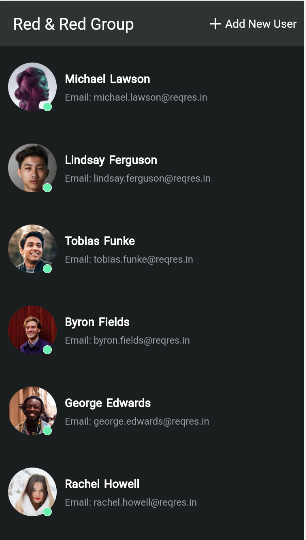
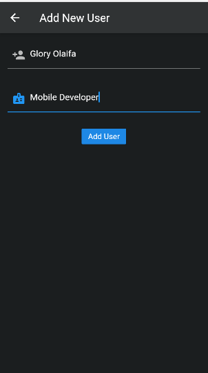
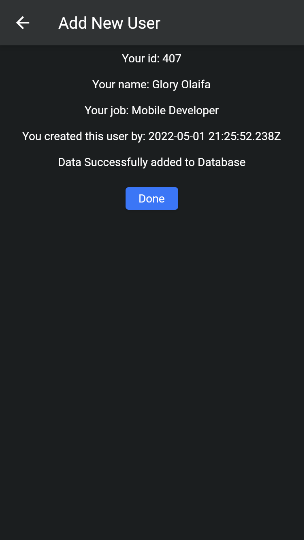
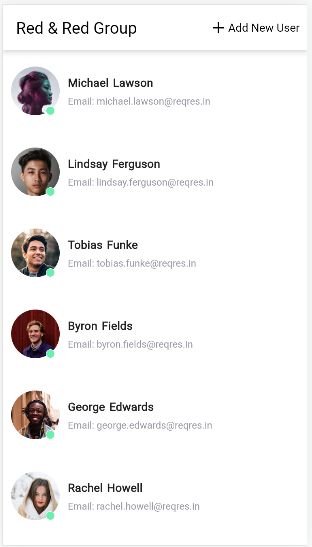
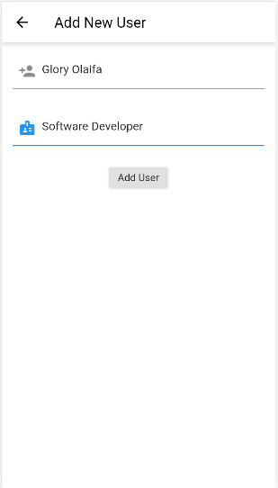

# Complete Red & Red Group🔥  

A simple BLoC state management. The first page(home) will simply fetch 6 users from the internet using BLoC to fetch the API. 
The second Screen which is +Add New User is used to add new user to the database Using a post request from a dummy API and once the data is added successfully it will display the Id and other information and a done button to return to the first page.

Kindly check out the Light and dark Mode of the simple application

Star⭐ the repo if you like what you see😉.

## ✨ Requirements

- Any Operating System (ie. MacOS X, Linux, Windows)
- Any IDE with SDK installed (ie. IntelliJ, Android Studio, VSCode etc)
- A little knowledge of Flutter and dart

## 📸 ScreenShots

## Dark
   
   

## Light
   
   

## 🌗 Dark theme

Adapts to device theme

## 🤓 Author(s)

**Olaifa Glory Israel** 

## 🔖 LICENCE

[WTFPL](http://www.wtfpl.net/about/)